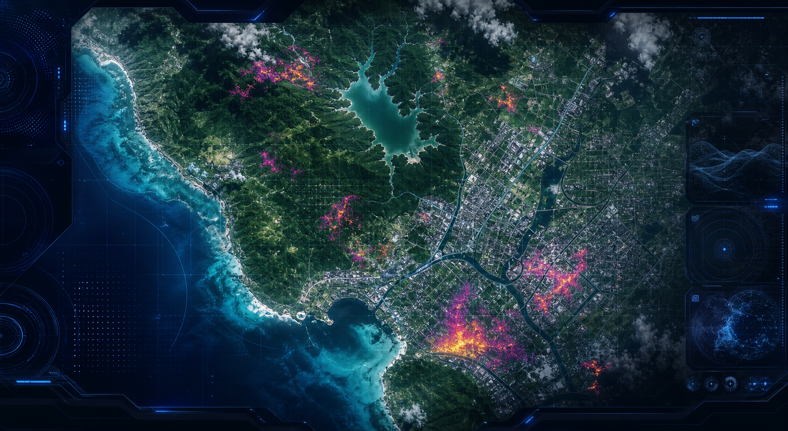

# Satellite Imagery or Drone Feed Change Tracker

A futuristic geospatial intelligence dashboard for tracking land, water, and urban change across satellite imagery or drone feeds. The project combines a polished React UI with a Python computer-vision pipeline that can compare georeferenced raster scenes over time.



## Highlights

- Futuristic multi-color dashboard built with React, TypeScript, Vite, and Lucide icons.
- Generated satellite-style hero asset committed inside the project.
- Change-detection concepts for deforestation, reservoir movement, urban sprawl, and burn scars.
- Python pipeline scaffold using Rasterio, OpenCV, NumPy, Shapely, and GeoJSON outputs.
- CI workflow that verifies the frontend builds cleanly on every push.

## Tech Stack

- Frontend: React, TypeScript, Vite, CSS
- Geospatial: Rasterio, GeoTIFF, CRS-aware reprojection, GeoJSON
- Computer Vision: OpenCV masks, NDVI, NDWI, optional YOLO or U-Net extensions
- Data Sources: Google Earth Engine, Landsat, Sentinel, drone orthomosaics

## Local Development

```bash
npm install
npm run dev
```

Open the local URL printed by Vite.

## Production Build

```bash
npm run build
```

## Python Pipeline

Install dependencies:

```bash
python -m venv .venv
.venv\Scripts\activate
pip install -r requirements.txt
```

Run a comparison:

```bash
python cv_pipeline/change_detection.py --before data/before.tif --after data/after.tif --mode ndvi --out outputs/change-run
```

The pipeline writes:

- `change_mask.tif`
- `change_zones.geojson`
- `summary.json`

## Portfolio Story

This project demonstrates practical geospatial data science skills: handling large imagery, respecting coordinate systems, building CV change masks, exporting map-ready geospatial artifacts, and presenting the results through a high-end analytical interface.

## Repository

Public GitHub repository target:

```text
https://github.com/tirth1263/satellite-imagery-or-drone-feed-chage-tracker
```
